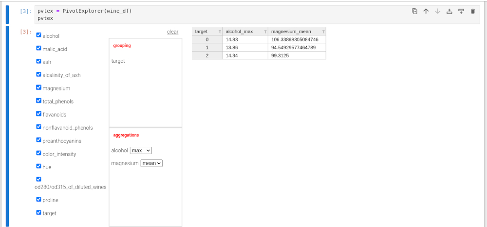

# PivotExplorer

Work in progress. Still working out desired behaviors and implementing functionality.

**PivotExplorer** is a Jupyter Widget intended to provide a drag-n-drop pivot table ui for Pandas dataframes.
Requires [anywidget]( https://github.com/manzt/anywidget) and [ipydatagrid](https://github.com/jupyter-widgets/ipydatagrid).

.
